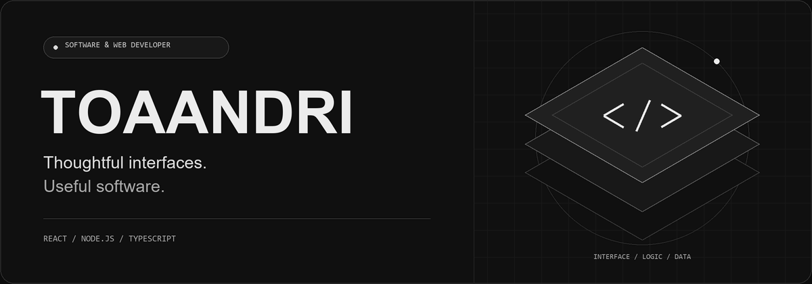
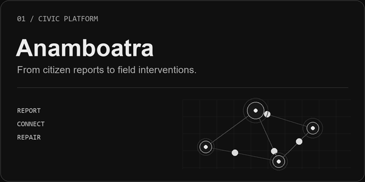
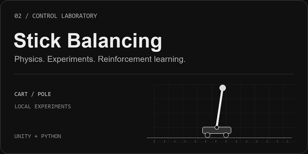
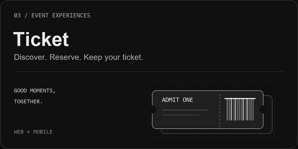
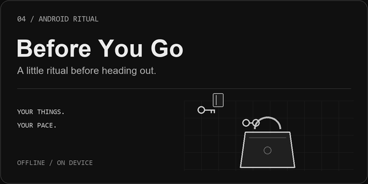
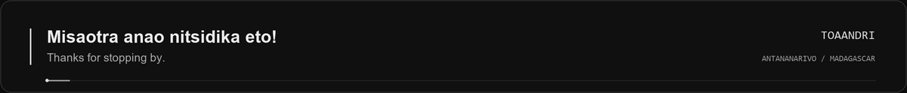

  

<h1 align="center">ANDRIANARIJERY Toaviniaina Maharavo</h1>

  Full-stack developer based in <strong>Antananarivo, Madagascar.</strong> 
  I build web and mobile experiences, from the interface to the API and database.

  
  
  

  Open to internships, collaborations and interesting projects.

  <a href="#selected-work">Selected work</a> &nbsp; / &nbsp;
  <a href="#toolkit">Toolkit</a> &nbsp; / &nbsp;
  <a href="#behind-the-code">Behind the code</a> &nbsp; / &nbsp;
  <a href="#lets-connect">Contact</a>

 

## Selected work

Civic infrastructure, a control laboratory, event ticketing and a small everyday Android ritual.

<table>
  <tr>
    <td width="50%" valign="top">
      
      
<strong>Anamboatra</strong> connects citizen reports, headquarters and field interventions to track public infrastructure in Madagascar.

      
REACT · EXPRESS · POSTGRESQL · EXPO

      
<a href="https://github.com/toaandri/Anamboatra"><strong>Explore the repository ↗</strong></a>

    </td>
    <td width="50%" valign="top">
      
      
<strong>Stick Balancing</strong> combines Unity physics, a desktop workspace and local reinforcement-learning experiments for cart-pole control.

      
UNITY · C# · PYTHON · REINFORCEMENT LEARNING

      
<a href="https://github.com/toaandri/Stick-balancing"><strong>Explore the repository ↗</strong></a>

    </td>
  </tr>
  <tr>
    <td width="50%" valign="top">
      
      
<strong>Ticket</strong> brings event discovery, seat reservations, a ticket wallet and organizer tools together across web and mobile, with test payments.

      
REACT · DJANGO · POSTGRESQL · EXPO

      
<a href="https://github.com/toaandri/ticket"><strong>Explore the repository ↗</strong></a>

    </td>
    <td width="50%" valign="top">
      
      
<strong>Before You Go</strong> is an offline Android app for composing your bag, confirming everyday objects and setting gentle departure reminders.

      
KOTLIN · JETPACK COMPOSE · ANDROID · OFFLINE

      
<a href="https://github.com/toaandri/BeforeYouGo"><strong>Explore the repository ↗</strong></a>

    </td>
  </tr>
</table>

  
View the still illustrations

   
  <a href="./assets/stills/header.png">Profile banner</a> ·
  <a href="./assets/stills/project-anamboatra.png">Anamboatra</a> ·
  <a href="./assets/stills/project-stick-balancing.png">Stick Balancing</a> ·
  <a href="./assets/stills/project-ticket.png">Ticket</a> ·
  <a href="./assets/stills/project-beforeyougo.png">Before You Go</a>

  <a href="https://github.com/toaandri?tab=repositories">Browse all repositories ↗</a>

## Toolkit

My core stack is **React, Node.js and TypeScript**, with React Native and Expo for mobile.

| Focus | Technologies |
| :--- | :--- |
| **Interfaces** | React · TypeScript · JavaScript · HTML · CSS · Tailwind CSS |
| **Mobile** | React Native · Expo |
| **Backend & APIs** | Node.js · NestJS · Express · REST · GraphQL · WebSockets |
| **Data** | PostgreSQL · MongoDB · Redis · Firebase · Supabase |
| **Delivery & testing** | Git · Docker · GitHub Actions · Vercel · Jest · Vitest · Cypress · Playwright |

  
Other languages & infrastructure

   
  Java · Python · PHP · Kubernetes · AWS

## Behind the code

I enjoy connecting the pieces of an application: an interactive frontend, a structured backend and a database that supports the experience. My focus is on **clean, maintainable code** and software that is useful to the people using it.

- **Web & mobile** — building interfaces and the services behind them.
- **Connected experiences** — working with REST, GraphQL and real-time communication.
- **Curiosity** — exploring machine learning alongside application development.

  
GitHub activity & language overview

   
  

    
    
  

 

## Let's connect

Have an internship opportunity, a collaboration or a project in mind? **Let's talk.**

**[Portfolio ↗](https://toaandri.vercel.app)** &nbsp; / &nbsp; **[LinkedIn ↗](https://www.linkedin.com/in/maharavo)** &nbsp; / &nbsp; **[Email ↗](mailto:toavinamaharavo@gmail.com)**

 

  

